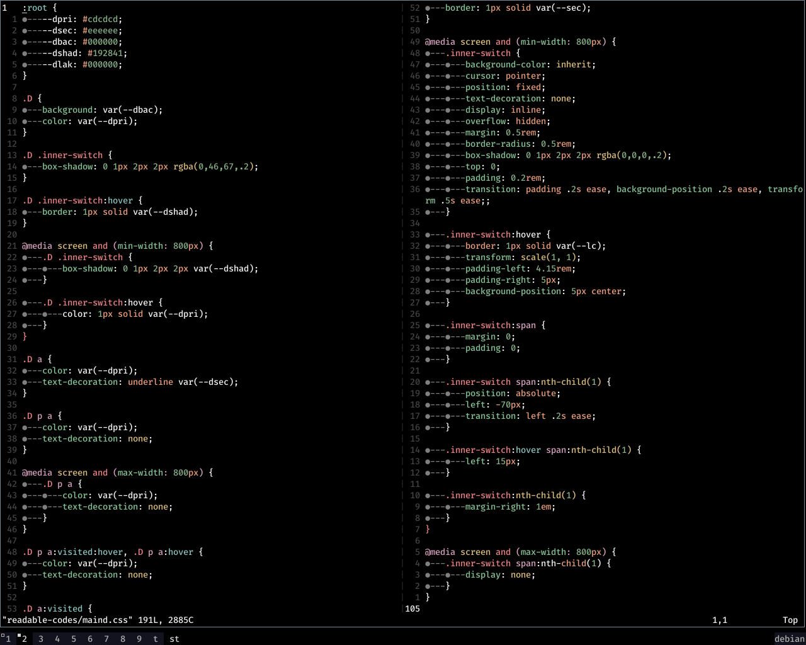

# ⚠ Update, December 2024: Account Migration to [github.com/samiulahmedjoy](https://github.com/samiulahmedjoy)

# A customized version of miramare color scheme for vim.

Made some tiny modifications to the [miramare.vim](https://github.com/franchbach/miramare) color scheme.

* Changed the background to black.

* Changed  the foreground color to #f0f0f0

* Made the comment color to be a bit brighter

* Changed the special character fg color

* Made minor changes for \*.css type files

* Changed the visual select fg and bg colors

* Minor changes for markdown.md files[header and delimiter colors]

## [Screenshots]

